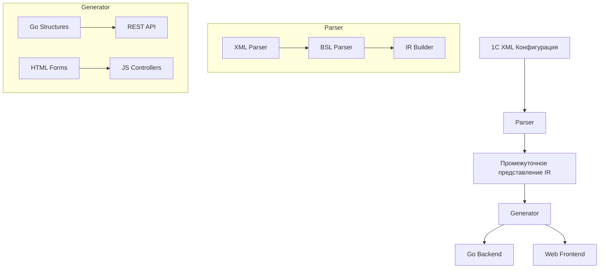

# Архитектура проекта

## Общий пайплайн

## Компоненты системы

### Parser
- Чтение XML конфигурации 1С
- Извлечение метаданных (справочники, документы, реквизиты)
- Парсинг BSL кода (модули, процедуры)
- Формирование промежуточного представления (IR)

### Generator
- Генерация Go структур для справочников и документов
- Создание REST API эндпоинтов
- Генерация HTML форм
- Генерация JavaScript контроллеров

### Backend (Go)
- REST API для работы с данными
- Бизнес-логика (на основе правил из 1С)
- Работа с БД

### Frontend (Web)
- HTML формы для редактирования данных
- JavaScript для обработки событий
- Взаимодействие с REST API
